# 網站架構圖

以下依目前專案中的 `frontend/app` 頁面路由與 `myapp/urls.py` 對應入口整理。

## Mermaid 樹狀圖

```mermaid
flowchart TD
    HOME["首頁 /"]

    HOME --> AUTH["會員驗證"]
    HOME --> SHOP["商品瀏覽"]
    HOME --> CARTFLOW["購物流程"]
    HOME --> MEMBER["會員中心"]
    HOME --> SELLER["賣家中心"]
    HOME --> COMMUNITY["社群論壇"]
    HOME --> STAFF["管理後台"]
    HOME --> DOCS["文件 / 開發工具"]

    AUTH --> LOGIN["登入 /login"]
    AUTH --> REGISTER["註冊 /register"]
    AUTH --> FORGOT["忘記密碼 /forgot-password"]
    AUTH --> RESET["重設密碼 /reset-password"]

    SHOP --> PRODUCTS["商品列表 /products"]
    SHOP --> PRODUCT_DETAIL["商品詳情 /products/[slug]"]
    SHOP --> COMPARE["商品比較 /products/compare"]
    SHOP --> BRAND["品牌頁 /brands/[brand_slug]"]
    SHOP --> CATEGORY["分類頁 /categories/[category_slug]"]

    PRODUCT_DETAIL --> REVIEWS["評論"]
    PRODUCT_DETAIL --> QUESTIONS["提問 / 回答"]
    PRODUCT_DETAIL --> RECOMMEND["推薦商品"]
    PRODUCT_DETAIL --> PRICE_COMPARE["比價資訊"]
    PRODUCT_DETAIL --> FAVORITE["收藏 / 比較切換"]

    CARTFLOW --> CART["購物車 /cart"]
    CARTFLOW --> CHECKOUT["結帳 /checkout"]
    CARTFLOW --> ORDERS["我的訂單 /orders"]
    ORDERS --> ORDER_DETAIL["訂單詳情 /orders/[id]"]
    ORDER_DETAIL --> PAYMENT["藍新金流 Sandbox / 付款流程"]

    MEMBER --> DASHBOARD["會員中心首頁 /me/dashboard"]
    MEMBER --> PROFILE["會員資料 /me/profile"]
    MEMBER --> ADDRESS["地址簿 /me/addresses"]
    MEMBER --> INVOICE["發票資料 /me/invoice"]
    MEMBER --> PROMOTION["首頁宣傳申請 /me/promotions"]

    SELLER --> MY_PRODUCTS["我的商品 /me/products"]
    SELLER --> SHIPPING["賣家運費設定 /me/shipping-rules"]
    SELLER --> SALES["賣家訂單 /me/sales"]
    SELLER --> SALES_REPORT["銷售報表 /me/sales/report"]

    MY_PRODUCTS --> PRODUCT_NEW["新增商品 /me/products/new"]
    MY_PRODUCTS --> PRODUCT_EDIT["編輯商品 /me/products/[slug]"]
    SALES --> SALES_DETAIL["賣家訂單詳情 /me/sales/[id]"]

    COMMUNITY --> COMMUNITY_LIST["論壇列表 /community"]
    COMMUNITY --> COMMUNITY_DETAIL["文章詳情 /community/[id]"]
    COMMUNITY_DETAIL --> COMMUNITY_REPLY["回覆 / 投票"]

    STAFF --> STAFF_DASHBOARD["後台首頁 /staff/dashboard"]
    STAFF --> STAFF_PRODUCTS["商品管理 /staff/products"]
    STAFF --> STAFF_REVIEWS["賣家申請與上架審核 /staff/reviews"]
    STAFF --> STAFF_ORDERS["平台訂單 /staff/orders"]
    STAFF --> STAFF_USERS["會員管理 /staff/users"]
    STAFF --> STAFF_BANNERS["Banner 管理 /staff/banners"]
    STAFF --> STAFF_CONTENT_REVIEWS["評論總覽 /staff/content/reviews"]
    STAFF --> STAFF_CONTENT_QUESTIONS["提問總覽 /staff/content/questions"]
    STAFF --> STAFF_CONTENT_POSTS["論壇文章總覽 /staff/content/posts"]

    STAFF_ORDERS --> STAFF_ORDER_DETAIL["平台訂單詳情 /staff/orders/[id]"]

    DOCS --> ROUTE_DOCS["路由對照文件 /docs/routes"]
    DOCS --> DEV_MAILBOX["開發信箱 /dev/mailbox"]
```



## 純文字版

```text
首頁 /
├─ 會員驗證
│  ├─ 登入 /login
│  ├─ 註冊 /register
│  ├─ 忘記密碼 /forgot-password
│  └─ 重設密碼 /reset-password
├─ 商品瀏覽
│  ├─ 商品列表 /products
│  ├─ 商品詳情 /products/[slug]
│  │  ├─ 評論
│  │  ├─ 提問 / 回答
│  │  ├─ 推薦商品
│  │  ├─ 比價資訊
│  │  └─ 收藏 / 比較切換
│  ├─ 商品比較 /products/compare
│  ├─ 品牌頁 /brands/[brand_slug]
│  └─ 分類頁 /categories/[category_slug]
├─ 購物流程
│  ├─ 購物車 /cart
│  ├─ 結帳 /checkout
│  └─ 我的訂單 /orders
│     └─ 訂單詳情 /orders/[id]
├─ 會員中心
│  ├─ 會員中心首頁 /me/dashboard
│  ├─ 會員資料 /me/profile
│  ├─ 地址簿 /me/addresses
│  ├─ 發票資料 /me/invoice
│  └─ 首頁宣傳申請 /me/promotions
├─ 賣家中心
│  ├─ 我的商品 /me/products
│  │  ├─ 新增商品 /me/products/new
│  │  └─ 編輯商品 /me/products/[slug]
│  ├─ 賣家運費設定 /me/shipping-rules
│  ├─ 賣家訂單 /me/sales
│  │  └─ 賣家訂單詳情 /me/sales/[id]
│  └─ 銷售報表 /me/sales/report
├─ 社群論壇
│  ├─ 論壇列表 /community
│  └─ 文章詳情 /community/[id]
└─ 管理後台
   ├─ 後台首頁 /staff/dashboard
   ├─ 商品管理 /staff/products
   ├─ 賣家申請與上架審核 /staff/reviews
   ├─ 平台訂單 /staff/orders
   │  └─ 平台訂單詳情 /staff/orders/[id]
   ├─ 會員管理 /staff/users
   ├─ Banner 管理 /staff/banners
   ├─ 評論總覽 /staff/content/reviews
   ├─ 提問總覽 /staff/content/questions
   └─ 論壇文章總覽 /staff/content/posts
```

## 整理依據

- 前端頁面路由: `frontend/app/**/page.tsx`
- Django 對應入口: `myapp/urls.py`
- API 對照: `myapp/api/urls.py`
